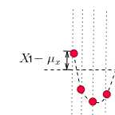

**抄袭知乎作者：https://www.zhihu.com/people/fintecher/activities**

##方差（Variance）##
**方差**是各个数据分别与其平均数之差的平方的和的平均数，用字母D表示。

例如：求1 2 3 4 5的方差 
平均数μ = 3  
S²=((1-3)²+(2-3)²+(3-3)²+(4-3)²+(5-3)²)/5=2
##协方差##
**协方差**在概率论和统计学中用于衡量两个变量的总体误差。而方差是协方差的一种特殊情况。通俗理解就是两个变量x,y在变化过程中是同方向变化还是反方向变化。若x变大的同时y也变大，说明两个变量是同向变化的，这时**协方差是正**的；若x变大而y变小，说明变量是反向变化的，这时**协方差是负**的。从数值来看，协方差的数值越大，两个变量同向程度也就越大。反之亦然。

**公式**

Cov(X,Y)=E[(X-μₓ)(Y-μᵧ)] 
公式理解： 如果有x,y两个变量，每个时刻的"x值与其均值之差"乘以"Y值与其均值之差"得到一个乘积，再对每时刻的乘积求和并求出均值。

例子：比如有两个变量x、y,观察t1-t7（7个时刻）他们的变化情况。分别用红点和绿点表示X、Y，横轴是时间。可以看到X，Y均围绕各自的均值运动，并且很明显是同向变化的。  
  
这时，我们发现每一时刻X-μₓ的值与Y-μᵧ的值的“正负号”一定相同（如下图：比如t1时刻，他们同为正，t2时刻他们同为负）：  
  
所以，像上图那样，当他们同向变化时，X-μₓ与Y-μᵧ的乘积为正。这样，当你把t1-t7时刻X-μₓ与Y-μᵧ的乘积加在一起，求平均后也就是正数了。

如果反向运动呢？
  
很明显，X-μₓ的值与Y-μᵧ的值的“正负号”一定相反，于是X-μₓ与Y-μᵧ的乘积就是负值了。这样当你把t1-t7时刻X-μₓ与Y-μᵧ的乘积加在一起，求平均的时候也就是负数了。

当然上面说的是两种特殊情况，很多时候X，Y的运动是不规律的，比如：  
  

  
这时，很可能某一时刻X-μₓ的值与Y-μᵧ的值乘积为正，另外一个时刻X-μₓ的值与Y-μᵧ的值乘积为负。 
将每一时刻X-μₓ与Y-μᵧ的乘积加在一起，其中的正负项就会抵消掉，最后求平均得出的值就是协方差，通过协方差的数值大小，就可以判断这两个变量同向或反向的程度了。 
所以，t1-t7时刻中，X-μₓ与Y-μᵧ的乘积为正的越多，说明同向变化的次数越多，也即同向程度越高。反之亦然。 
总结一下，如果协方差为正，说明X，Y同向变化，协方差越大说明同向程度越高；如果协方差为负，说明X，Y反向运动，协方差越小说明反向程度越高。

##相关系数##
**公式** 
ρ=Cov(X,Y)/σₓσᵧ  
**理解：**就是用X、Y的协方差除以X的标准差和Y的标准差。相关系数也可以看成协方差：一种剔除了两个变量量纲影响、标准化后的特殊协方差。  
**特点**  
1、也可以反映两个变量变化时是同向还是反向，如果同向变化就为正，反向变化就为负。  
2、由于它是标准化后的协方差，因此更重要的特性来了：它消除了两个变量变化幅度的影响，而只是单纯反应两个变量每单位变化时的相似程度。  
**例子**
承接上文中的变量X、Y变化的示意图（X为红点，Y为绿点），来看两种情况：

很容易就可以看出以上两种情况X，Y都是同向变化的，而这个“同向变化”，有个非常显著特征：X、Y同向变化的过程，具有极高的相似度！无论第一还是第二种情况下，都是：t1时刻X、Y都大于均值，t2时刻X、Y都变小且小于均值，t3时刻X、Y继续变小且小于均值，t4时刻X、Y变大但仍小于均值，t5时刻X、Y变大且大于均值……  

可是，计算一下他们的协方差，  
第一种情况下：  
[(100-0)x(70-0)+(-100-0)x(-70-0)+(-200-0)x(-200-0)...]÷7≈15428.57  
第二种情况下：  
[(0.01-0)x(70-0)+(-0.01-0)x(-70-0)+(-0.02-0)x(-200-0)...]÷7≈1.542857  
协方差差出了一万倍，只能从两个协方差都是正数判断出两种情况下X、Y都是同向变化，但是，一点也看不出两种情况下X、Y的变化都具有相似性这一特点。

这是为什么呢？

因为以上两种情况下，在X、Y两个变量同向变化时，X变化的幅度不同，这样，两种情况的协方差更多的被变量的变化幅度所影响了。  
所以，为了能准确的研究两个变量在变化过程中的相似程度，我们就要把变化幅度对协方差的影响，从协方差中剔除掉。于是，相关系数就横空出世了，就有了最开始相关系数的公式：

ρ=Cov(X,Y)/σₓσᵧ 

那么为什么要通过除以标准差的方式来剔除变化幅度的影响呢？咱们简单从标准差公式看一下：

从公式可以看出，标准差计算方法为，每一时刻变量值与变量均值之差再平方，求得一个数值，再将每一时刻这个数值相加后求平均，再开方。

“变量值与变量均值之差”X-\mu _{x}是什么呢？就是偏离均值的幅度:

那为何要对它做平方呢？因为有时候变量值与均值是反向偏离的（见下图），X-\mu _{x}是个负数，平方后，就可以把负号消除了。这样在后面求平均时，每一项数值才不会被正负抵消掉，最后求出的平均值才能更好的体现出每次变化偏离均值的情况。

当然，最后求出平均值后并没有结束，因为刚才为了消除负号，把X-\mu _{x}进行了平方，那最后肯定要把求出的均值开方，将这个偏离均值的幅度还原回原来的量级。于是就有了下面标准差的公式：

所以标准差描述了变量在整体变化过程中偏离均值的幅度。协方差除以标准差，也就是把协方差中变量变化幅度对协方差的影响剔除掉，这样协方差也就标准化了，它反应的就是两个变量每单位变化时的情况。这也就是相关系数的公式含义了。

同时，你可以反过来想象一下：既然相关系数是协方差除以标准差，那么，当X或Y的波动幅度变大的时候，它们的协方差会变大，标准差也会变大，这样相关系数的分子分母都变大，其实变大的趋势会被抵消掉，变小时也亦然。于是，很明显的，相关系数不像协方差一样可以在＋∞ 到－∞ 间变化，它只能在＋1到－1之间变化（相关系数的取值范围在＋1到－1之间变化可以通过施瓦茨不等式来证明，有些复杂，这里就不赘述了，有兴趣的可以google下）。

总结一下，对于两个变量X、Y，当他们的相关系数为1时，说明两个变量变化时的正向相似度最大，即，你变大一倍，我也变大一倍；你变小一倍，我也变小一倍。也即是完全正相关（以X、Y为横纵坐标轴，可以画出一条斜率为正数的直线，所以X、Y是线性关系的）。  

随着他们相关系数减小，两个变量变化时的相似度也变小，当相关系数为0时，两个变量的变化过程没有任何相似度，也即两个变量无关。
  
当相关系数继续变小，小于0时，两个变量开始出现反向的相似度，随着相关系数继续变小，反向相似度会逐渐变大。

当相关系数为－1时，说明两个变量变化的反向相似度最大，即，你变大一倍，我变小一倍；你变小一倍，我变大一倍。也即是完全负相关（以X、Y为横纵坐标轴，可以画出一条斜率为负数的直线，所以X、Y也是线性关系的）。

有了上面的背景，我们再回到最初的变量X、Y的例子中，可以先看一下第一种情况的相关系数：

X的标准差为  
σX = √([(100-0)²+(-100-0)²+(-200-0)²...]÷7)≈130.9307  
Y的表准差为  
σY = √([(70-0)²+(-70-0)²+(-200-0)²...]÷7)≈119.2836  
于是相关系数为
ρ =15428.57 ÷ (130.9307 x 119.2836) ≈ 0.9879  
说明第一种情况下，X的变化与Y的变化具有很高的相似度，而且已经接近完全正相关了，X、Y几乎就是线性变化的。

那第二种情况呢？

X的标准差为  
σX = √([(0.01-0)²+(-0.01-0)²+(-0.02-0)²...]÷7)≈0.01309307  
Y的标准差为     
σY = √([(70-0)²+(-70-0)²+(-200-0)²...]÷7)≈119.2836  
ρ =1.542857 ÷ (0.01309307 x 119.2836) ≈ 0.9879  
说明第二种情况下，虽然X的变化幅度比第一种情况X的变化幅度小了10000倍，但是丝毫没有改变“X的变化与Y的变化具有很高的相似度”这一结论。同时，由于第一种、第二种情况的相关系数是相等的，因此在这两种情况下，X、Y的变化过程有着同样的相似度。